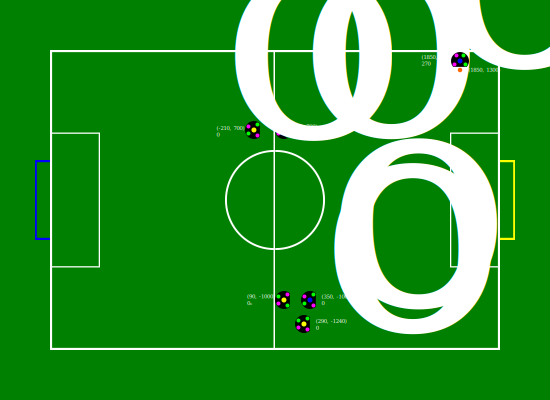
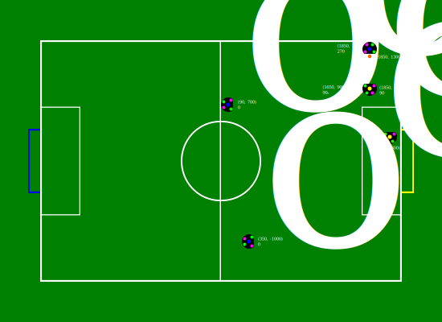
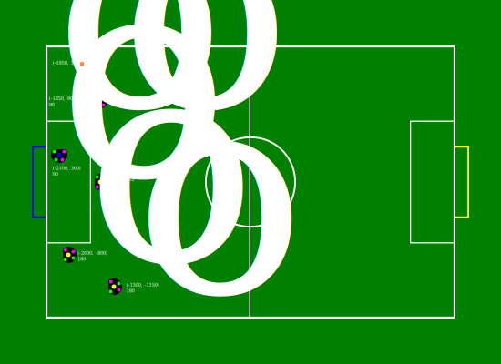
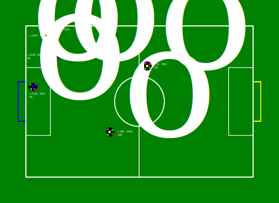
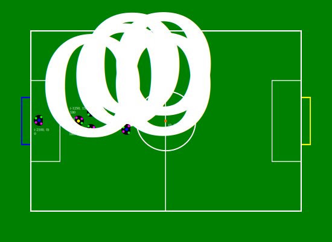
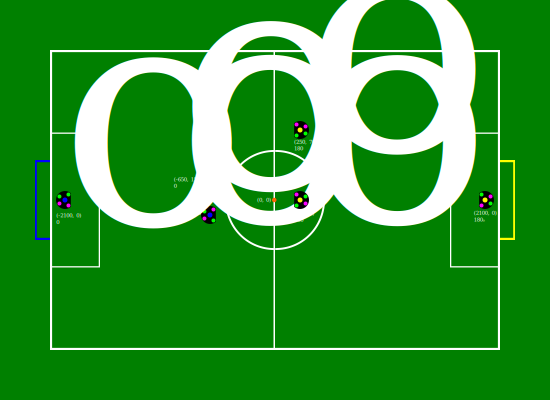
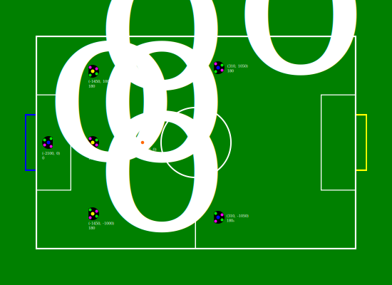
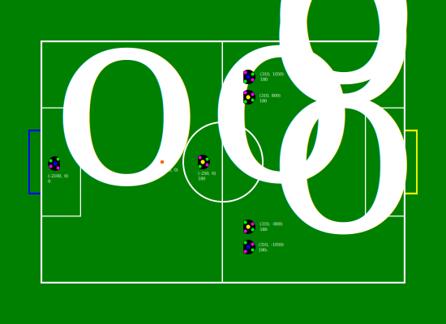

:source-highlighter: highlightjs
:icons: font

= RoboCup Brazil 2024 SSL-EL hardware challenge 
:toc:
:toclevels: 3

== Challenge
==== Objective

Given the goal of preparing SSL Entry Level teams to participate in SSL Regular division, this technical challenge aims to encourage EL teams to develop autonomously robot placement in recurring game scenarios. 

==== Procedure

The Robot Placement Technical Challenge will be executed using the Game Controller manual controls. Therefore, the procedure is as follows: 

1. The Game Controller, SSL Vision and Auto Referee must be already running; 
2. The robots must be placed on one of the scenarios position; 
3. When all positions are correct, the challenge will start; 
4. Then, the Kick-Off/Free Kick/Penalty Kick command will be issued (according to scenario). 

The starting and desired positions of the robots can be seen in the 4.0 Section at the end of the document. The "Start" is the starting position, and the "Goal" is the position where the robots must be placed.  

==== Evaluation

Every team participates in the same scenario and has 3 tries per scenario. The maximum time for each try is 30 seconds. The 30 seconds considers only the time for completing the challenges, it’s up to the TC setting up the scenarios.  

In total, there will be 4 scenarios in this challenge. The order of the scenarios will be in ascending order (scenarios 1 to 4), where all teams are going to do their 3 tries at scenario 1 first, and so on. 

In total, there will be 2 TC's evaluating the Technical Challenge, one to operate the Game Controller and another to keep the points and position the robots. Furthermore, the TC will mark the robot position at the field with tape or chalk for each scenario. 

====Scoring 

For every scenario, the following criteria will be evaluated: 

1. Moving the robot to the desired position (each robot) — +5 
2. Colliding with a team robot during the placement — -1
3. Colliding with obstacles (ball or opponent robots) during the placement — -1 
4. Colliding with one of field boundary — -1 

NOTE: A collision between two or more team robots will count as one collision, i.e., the collision will cost -1 for the team, not -1 for each robot.

The points above are for a single robot, that is, the maximum score for each scenario is 15 points. The partial points of each scenario will be summed up. In the case of ties, the criteria described in section 3.2 will be applied. 

The TC reserves the right to change the evaluation procedure.  

==== Tiebreak criteria 

1. The team with the most points summed after completing all scenarios wins; 
2. The team with the most points at scenario 1 wins [very difficult scenario]; 
3. The team with the most points at scenario 2 wins [difficult scenario]; 
4. The team with the most points at scenario 3 wins [medium scenario]; 
5. The team with the most points at scenario 4 wins [easy scenario]; 

Example: team A and B with 10 points; Team A: 4 points at scenario 4 + 6 points at scenario 3; Team B: 6 points at scenario 4 + 4 points at scenario 3; Team B wins. 

== Scenarios 

=== Scenario 1: Free Kick 1
==== Start

==== Goal

=== Scenario 2: Free Kick 2
==== Start

==== Goal

=== Scenario 3: Kick Off
==== Start

==== Goal

=== Scenario 4: Penalty
==== Start

==== Goal
